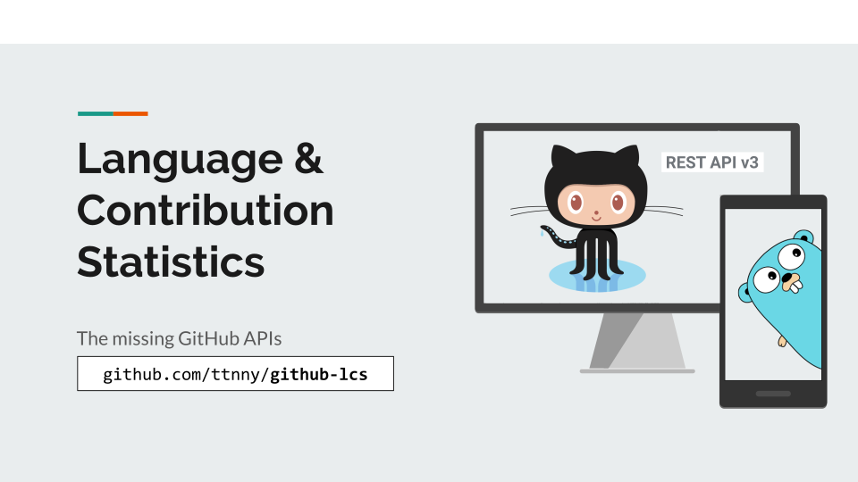
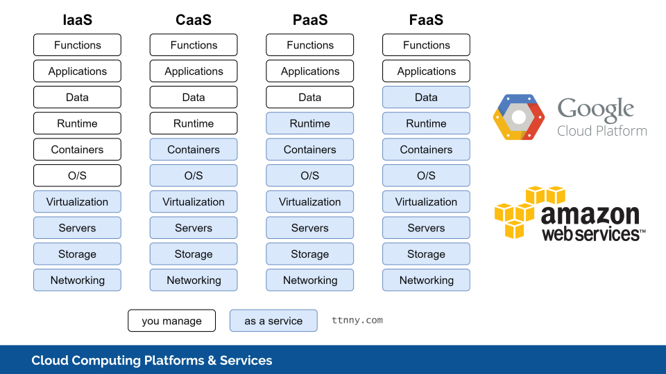
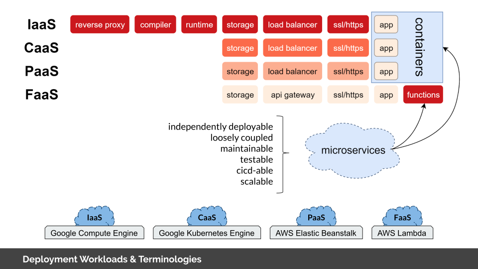
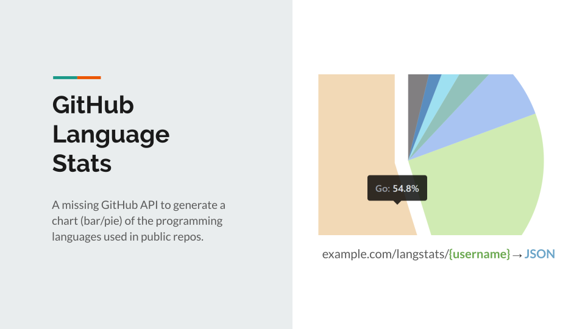
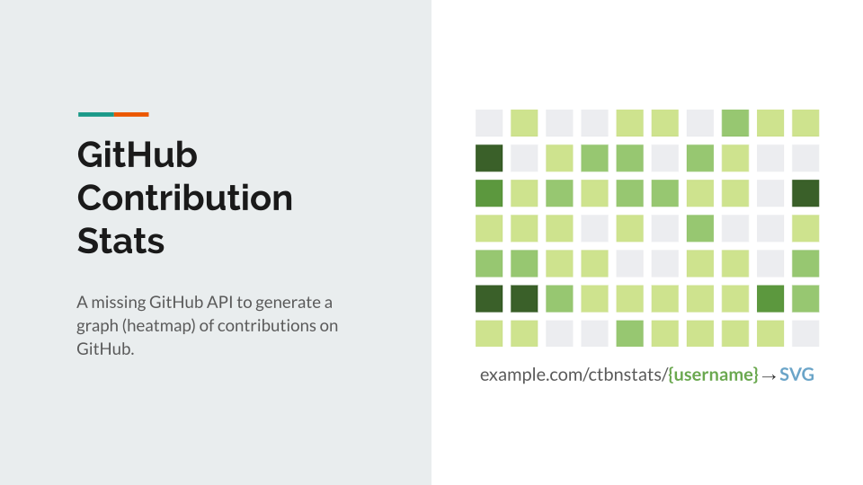

# GitHub Language & Contribution Statistics
GitHub LCS, the missing GitHub APIs to create:
- A chart (bar/pie) of programming languages used in all public repositories
- A graph (heatmap) of contributions on GitHub



### Cloud Computing Platforms & Services
Learning-by-doing, this project is deployed to different Cloud Computing Platforms and Services.
- Platforms: Google Cloud Platform (GCP), Amazon Web Services (AWS)
- Services:
    - IaaS: Google Compute Engine
    - CaaS: Google Kubernetes Engine
    - PaaS: AWS Elastic Beanstalk
    - FaaS: AWS Lambda (a serverless architecture)
    
**Note**: checkout the `aws-lambda` branch for details on deploying AWS Lambda functions.
    


### Deployment Workloads



# API Usages

These two APIs are deployed to production with AWS Lambda. Please feel free to give them a try. There is no tracking code.

**langStats** invoke URL:
```
https://61lfz00oi9.execute-api.us-west-2.amazonaws.com/prod/langstats/{username}
```



**ctbnStats** invoke URL:
```
https://61lfz00oi9.execute-api.us-west-2.amazonaws.com/prod/ctbnstats/{username}
```

