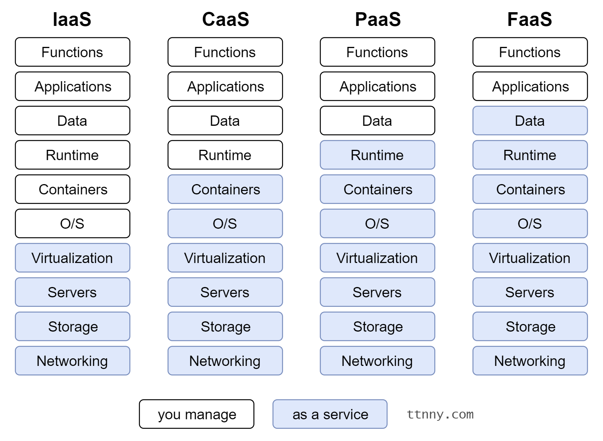

# GitHub Language & Contribution Statistics
GitHub LCS, the missing GitHub APIs to create:
- A chart (bar/pie) of programming languages used in all public repositories
- A graph (heatmap) of contributions on GitHub

### Deployments
Learning-by-doing, this project is deployed to different Cloud Computing Platforms and Models
- Platforms: Google Cloud Platform (GCP), Amazon Web Services (AWS)
- Models:
    - IaaS: Google Compute Engine (GCE)
    - CaaS: Google Kubernetes Engine (GKE)
    - PaaS: AWS Elastic Beanstalk (EB)
    - FaaS: AWS Lambda (serverless architecture)
    

### Usage (APIs)
composing...

### Third-party APIs
composing...